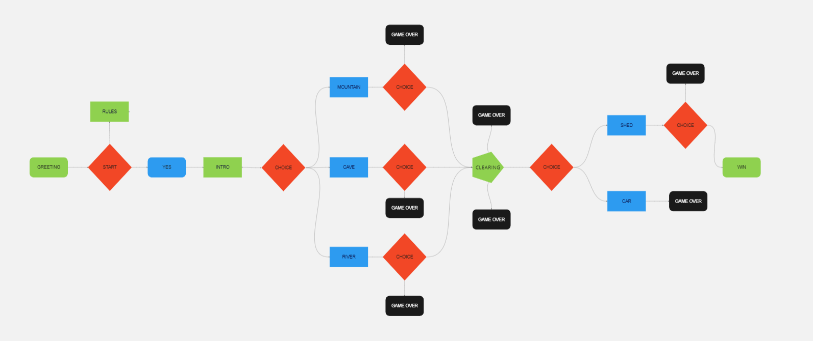
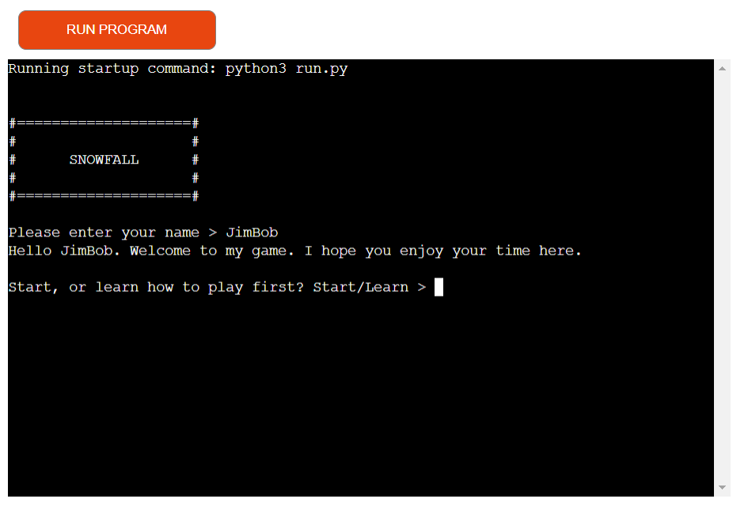
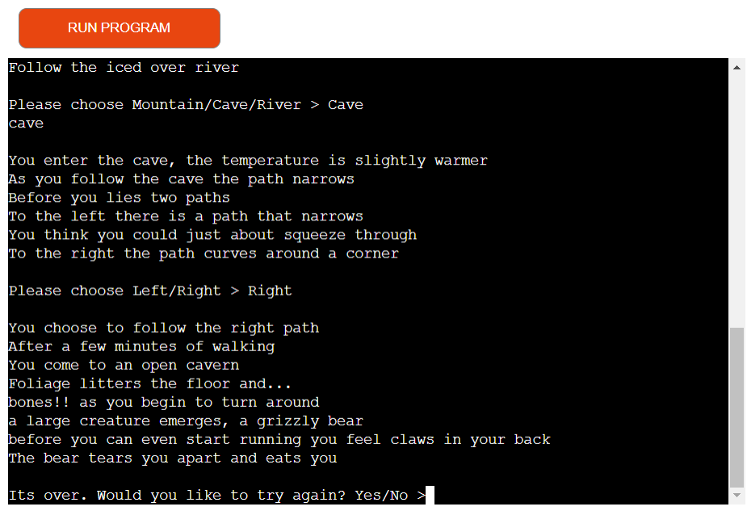
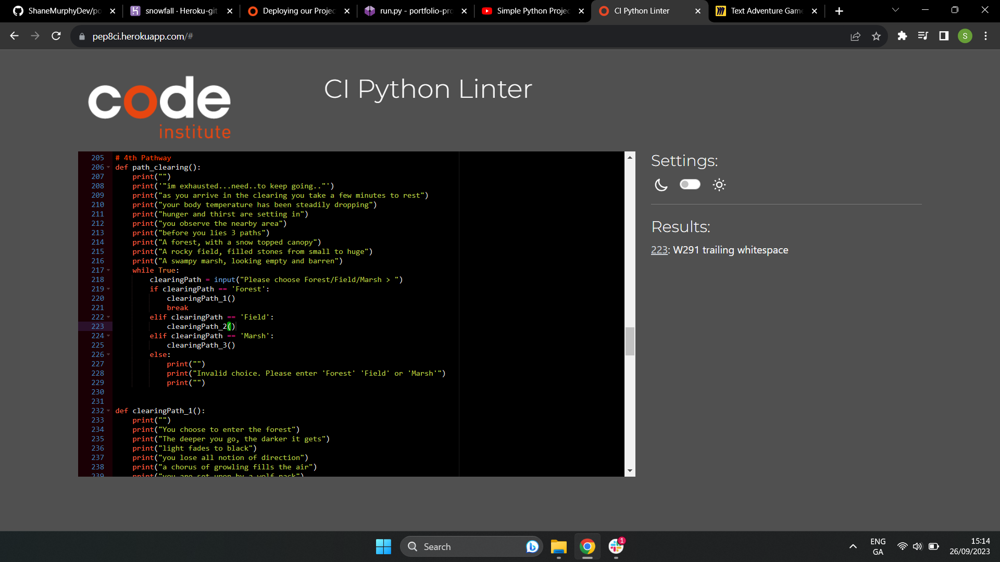

# SNOWFALL
[View the live project here.](https://snowfall-c93ef0e44aa3.herokuapp.com/)

Snow Fall is in essence, a game about surving the the brutal cold of a Tundra.
I choose this topic because I have an interest in survival stories.
My goal is to create an interactive and fun game in which
the player will have to make difficult choices in order to win.

## Features
The game will feature many branching pathways, some leading to a game over
and some leading to win scenario. The player will be given situational context 
and presented with options on which direction they would like to go.

- A retry funtion for quality of life gameplay
- Delayed text for immersion
- Name personalization
- Error validation
- Learn to play section

-   ### User stories

    -   #### First Time Visitor Goals

        1. As a First Time Visitor, I want to learn about the setting of the game
        2. As a First Time Visitor, I want to be able to easily learn how to play
        3. As a First Time Visitor, I want to have everything displayed clearly and understandably

    -   #### Returning Visitor Goals

        1. As a Returning Visitor, I want to find new pathways and hame content I missed on the first run
        2. As a Returning Visitor, I want to have fun exploring the game and be motivated to try new things
        3. As a Returning Visitor, I want to be challenged with new content 

    -   #### Frequent User Goals
        1. As a Frequent User, I want to check to see if there are any newly added pathways or content.

## Structure

As the player makes choices and used inputs, the game will progress and set the scene for them

### Languages used
-   [PYTHON](https://en.wikipedia.org/wiki/Python_(programming_language))

## Testing
The Ci Python Linter was used to validate every page of the project to ensure there were no syntax errors in the project.

## Deployment

### Heroku

This project has been deployed via Heroku

## Credits 

### Images

All images were created by the developer

### Code

I learned how to make a time delaye [here](https://realpython.com/python-sleep/)

All code was written by the developer

### Acknowledgements <3

-   My Mentor for continuous helpful feedback.

-   Tutor support at Code Institute for their support.