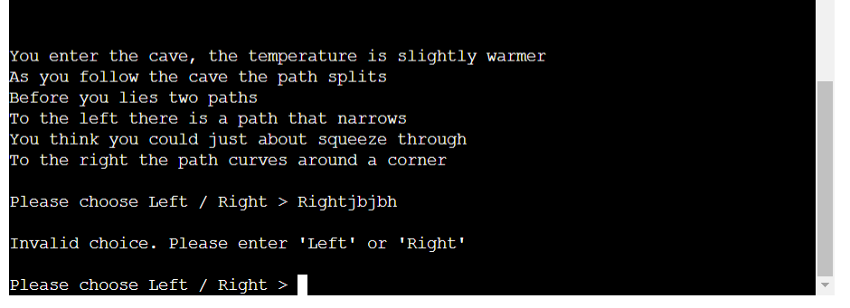
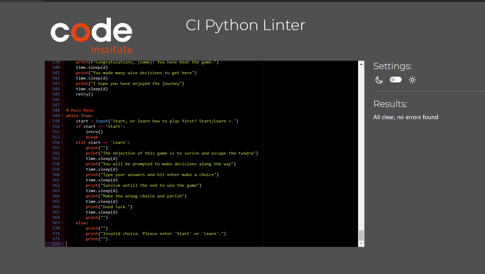

# SNOWFALL
[View the live project here.](https://snowfall-c93ef0e44aa3.herokuapp.com/)

Snow Fall is in essence, a game about surving the the brutal cold of a Tundra.
I choose this topic because I have an interest in survival stories.
My goal is to create an interactive and fun game in which
the player will have to make difficult choices in order to win.

## Features
The game will feature many branching pathways, some leading to a game over
and some leading to win scenario. The player will be given situational context 
and presented with options on which direction they would like to go.


- A retry funtion for quality of life gameplay

- Delayed text for immersion

- Name personalization

- Error validation

- Learn to play section

-   ### User stories

    -   #### First Time Visitor Goals

        1. As a First Time Visitor, I want to learn about the setting of the game
        2. As a First Time Visitor, I want to be able to easily learn how to play
        3. As a First Time Visitor, I want to have everything displayed clearly and understandably

    -   #### Returning Visitor Goals

        1. As a Returning Visitor, I want to find new pathways and hame content I missed on the first run
        2. As a Returning Visitor, I want to have fun exploring the game and be motivated to try new things
        3. As a Returning Visitor, I want to be challenged with new content 

    -   #### Frequent User Goals
        1. As a Frequent User, I want to check to see if there are any newly added pathways or content.


## Structure

As the player makes choices and used inputs, the game will progress and set the scene for them


### Error Validation
I have created a notification and correction for when when a player mistypes a command




### Testing User Stories from User Experience (UX) Section

-   #### First Time Visitor Goals

    - As a First Time Visitor, I want to easily understand the main purpose of the app and learn how to play the game

- I have put alot of time into text organization and clarity to ensure any users have a pleasant and easy experience

-   #### Returning Visitor Goals

    - As a Returning Visitor, I want to find new pathways, story, and outcomes when I replay the game

- I have created many possible outcomes and choices in the game to ensure the player would be excited to explore more

-   #### Frequent User Goals

    - As a Frequent User, I want to check to see if there are any newly added story, text, outcomes, options.

- I plan to update the game with addition pathways, choices, and outcomes so players would always feel like theres more to see


### Languages used

-   [PYTHON](https://en.wikipedia.org/wiki/Python_(programming_language))

## Testing

The Ci Python Linter was used to validate every page of the project to ensure there were no syntax errors in the project
I have tested all pathways and options in the game and have found no bugs or issues with the code





## Deployment

### Heroku

This project has been deployed via [Heroku](https://www.heroku.com/platform)

1. To deploy, one must first create an account
2. Create environment variables such as app name, location, and api key if applicable
3. Select deplyment method. Automatic updates, or Manual
4. Run program to access terminal and view live application


### Making a Local Clone

1. Log in to GitHub and locate the [GitHub Repository](https://github.com/)
2. Under the repository name, click "Clone or download".
3. To clone the repository using HTTPS, under "Clone with HTTPS", copy the link.
4. Open Git Bash
5. Change the current working directory to the location where you want the cloned directory to be made.
6. Type `git clone`, and then paste the URL you copied in Step 3.

```
$ git clone https://github.com/ShaneMurphyDev/portfolio-project-3
```

7. Press Enter. Your local clone will be created.

```
$ git clone https://github.com/ShaneMurphyDev/portfolio-project-3
> Cloning into `CI-Clone`...
> remote: Counting objects: 10, done.
> remote: Compressing objects: 100% (8/8), done.
> remove: Total 10 (delta 1), reused 10 (delta 1)
> Unpacking objects: 100% (10/10), done.
```

Click [Here](https://help.github.com/en/github/creating-cloning-and-archiving-repositories/cloning-a-repository#cloning-a-repository-to-github-desktop) to retrieve pictures for some of the buttons and more detailed explanations of the above process.


## Credits 

### Images

All images were created by the developer

### Code

I learned how to make a time delay [here](https://realpython.com/python-sleep/)

All code was written by the developer

### Acknowledgements <3

-   My Mentor for continuous helpful feedback.

-   Tutor support at Code Institute for their support.